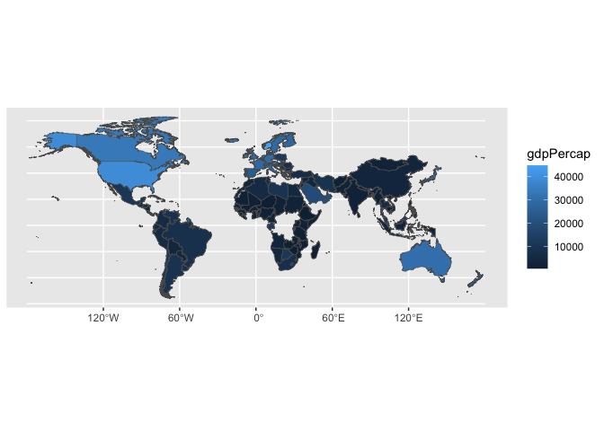
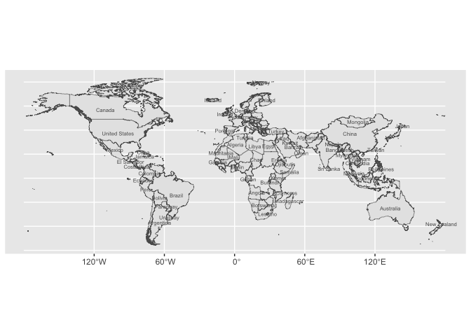
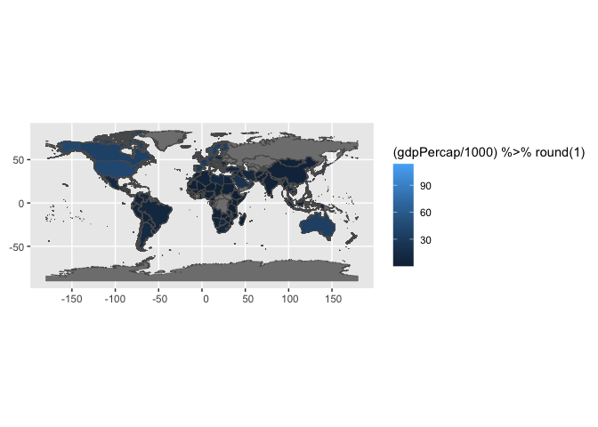
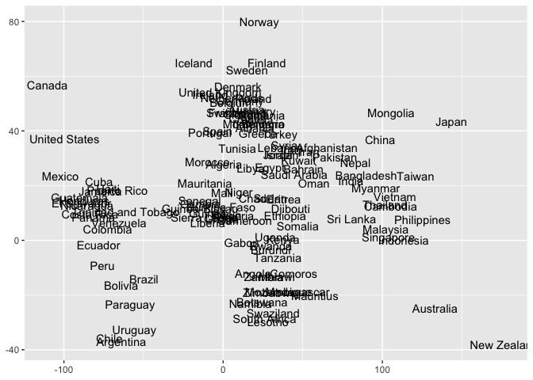
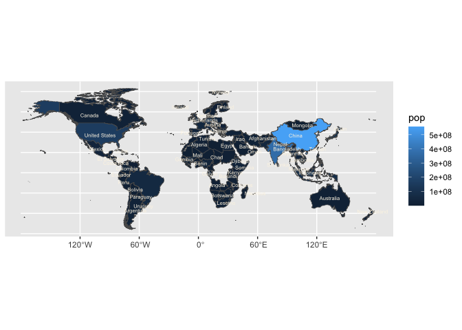

  - [{ggnaturalearth}](#ggnaturalearth)
      - [Installation](#installation)
      - [example: World choropleth made
        easy](#example-world-choropleth-made-easy)
      - [example with labels.](#example-with-labels)
  - [How we built this functionality](#how-we-built-this-functionality)
      - [Step 000. Find an appropriate shape
        file](#step-000-find-an-appropriate-shape-file)
      - [Step 00. Build the map with base ggplot2 and
        geom\_sf](#step-00-build-the-map-with-base-ggplot2-and-geom_sf)
  - [Step 0. Prepare reference
    datasets.](#step-0-prepare-reference-datasets)
      - [0.i geographic dataset
        collection/preparation](#0i-geographic-dataset-collectionpreparation)
      - [0.ii dataset documentation](#0ii-dataset-documentation)
  - [Write functions w/ ‘recipe’ substeps: 1. write compute function; 2.
    define ggproto; 3. write geom\_\*; 4.
    test.](#write-functions-w-recipe-substeps-1-write-compute-function-2-define-ggproto-3-write-geom_-4-test)
      - [Write `geom_country()` (polygon)](#write-geom_country-polygon)
      - [Write `geom_country_labels()` (polygon
        center)](#write-geom_country_labels-polygon-center)
      - [Write `stamp_roads()` (or roads)
        **Placeholder**](#write-stamp_roads-or-roads-placeholder)
          - [test it out](#test-it-out)
      - [Write `stamp_country()` (render polygons w/o
        data)](#write-stamp_country-render-polygons-wo-data)
  - [Part 2. Packaging and documentation 🚧
    ✅](#part-2-packaging-and-documentation--)
      - [minimal requirements for github package. Have
        you:](#minimal-requirements-for-github-package-have-you)
          - [Created files for package archetecture with
            `devtools::create("./ggbarlabs")`
            ✅](#created-files-for-package-archetecture-with-devtoolscreateggbarlabs-)
          - [Moved functions R folder? ✅](#moved-functions-r-folder-)
          - [Added roxygen skeleton? ✅](#added-roxygen-skeleton-)
          - [Managed dependencies ? ✅](#managed-dependencies--)
          - [Chosen a license? ✅](#chosen-a-license-)
          - [Run `devtools::check()` and addressed errors?
            ✅](#run-devtoolscheck-and-addressed-errors-)
      - [Listen 🚧](#listen-)
          - [Consulted with potential users
            🚧](#consulted-with-potential-users-)
          - [Consulted with technical
            experts](#consulted-with-technical-experts)
      - [Polish. Have you…](#polish-have-you)
          - [Settled on examples and put them in the roxygen skeleton?
            🚧](#settled-on-examples-and-put-them-in-the-roxygen-skeleton-)
          - [Written formal tests of functions?
            🚧](#written-formal-tests-of-functions-)
          - [Sent tests in this readme to package via readme2pkg
            🚧](#sent-tests-in-this-readme-to-package-via-readme2pkg-)
          - [Have you worked added a description and author information
            in the DESCRIPTION file?
            🚧](#have-you-worked-added-a-description-and-author-information-in-the-description-file-)
          - [Addressed *all* notes, warnings and errors.
            🚧](#addressed-all-notes-warnings-and-errors-)
      - [Promote](#promote)
          - [Package website built? 🚧](#package-website-built-)
          - [Package website deployed? 🚧](#package-website-deployed-)
      - [Harden](#harden)
          - [Submit to CRAN? 🚧](#submit-to-cran-)
  - [Reports, Environment](#reports-environment)
      - [Description file extract](#description-file-extract)
      - [Environment](#environment)
      - [`devtools::check()` report](#devtoolscheck-report)
  - [Install development package with
    `devtools::build()`](#install-development-package-with-devtoolsbuild)
      - [Repo Directory and files
        report](#repo-directory-and-files-report)
          - [](#section)
          - [Changing context](#changing-context)

<!-- README.md is generated from README.Rmd. Please edit that file -->

# {ggnaturalearth}

ggnaturalearth is a test of the ggnorthcarolina repo for use as a
template repo.

ggnaturalearth allows you to create informative world maps a flat
tabular data file. i.e. a file that has the country id in columns as
well as characteristics about the countries to be represented by fill
color for example.

## Installation

You can install the development version of ggnaturalearth from
[GitHub](https://github.com/) with:

``` r
# install.packages("devtools")
devtools::install_github("EvaMaeRey/ggnaturalearth")
```

## example: World choropleth made easy

Country characteristics data, and wanting to map that data, but not
having experience with boundary files or just not wanting to think about
joins to use a geom\_sf() layer.

``` r
library(tidyverse) 
library(gapminder)
library(ggnaturalearth)

gapminder |>
  filter(year == 2002) %>% 
  ggplot() +
  aes(country_name = country) +
  geom_country()
#> Joining with `by = join_by(country_name)`
```


``` r

last_plot() + 
  aes(fill = gdpPercap)
#> Joining with `by = join_by(country_name)`
```



And here is the input dataset, which is indeed just a tabular, flat
dataset. It has no boundary information

``` r
library(gapminder)
gapminder
#> # A tibble: 1,704 × 6
#>    country     continent  year lifeExp      pop gdpPercap
#>    <fct>       <fct>     <int>   <dbl>    <int>     <dbl>
#>  1 Afghanistan Asia       1952    28.8  8425333      779.
#>  2 Afghanistan Asia       1957    30.3  9240934      821.
#>  3 Afghanistan Asia       1962    32.0 10267083      853.
#>  4 Afghanistan Asia       1967    34.0 11537966      836.
#>  5 Afghanistan Asia       1972    36.1 13079460      740.
#>  6 Afghanistan Asia       1977    38.4 14880372      786.
#>  7 Afghanistan Asia       1982    39.9 12881816      978.
#>  8 Afghanistan Asia       1987    40.8 13867957      852.
#>  9 Afghanistan Asia       1992    41.7 16317921      649.
#> 10 Afghanistan Asia       1997    41.8 22227415      635.
#> # ℹ 1,694 more rows
```

By declaring the aesthetic fips, the geom\_ function joins the flat file
to boundary data and an SF layer is plotted.

## example with labels.

Furthermore, we also make labeling these polygons easy:

``` r
library(tidyverse)
gapminder |>
  filter(year == 2002) %>% 
  ggplot() +
  aes(country_name = country) +
  geom_country() + 
  geom_country_label(aes(label = country),
                     check_overlap = T,
                     size = 2)
#> Joining with `by = join_by(country_name)`
#> Joining with `by = join_by(country_name)`
```


``` r

ggwipe::last_plot_wipe_last() + 
  geom_country_label(aes(label = country),
    lineheight = .8,
    size = 2, 
    check_overlap = TRUE,
    color = "grey35")
#> Joining with `by = join_by(country_name)`
#> Joining with `by = join_by(country_name)`
```



<!-- badges: start -->

<!-- badges: end -->

# How we built this functionality

The second-order goal of ggnorthcarolina is to serve as a model and
template for other ggplot-based geography-specific convenience mapping
packages. Because of this, and because the package is generally new and
could use other sets of eyes on pretty much every decision, I’m using a
literate programming paradigm to write a narrative for this package.

## Step 000. Find an appropriate shape file

A prerequisite to embarking on the following journey is that you have
geographic data that you’d like to connect up to a flat file for mapping
within ggplot2. In our case, for convenience, we use nc.shp provided in
the sf package. You’ll see that file read in as an sf object later with
the following code.

Such a shape file can live in the data-raw folder, or can be accessed
from another package:

    st_read(system.file("shape/nc.shp", package="sf")) 

## Step 00. Build the map with base ggplot2 and geom\_sf

This doesn’t show all the pain that you will actually be in if you want
to create a choropleth. Because we are working with an object that
already has geometries as a list-column. If you were working with a flat
file (which is the imagined )

``` r
library(tidyverse)
rnaturalearth::ne_countries(  
  scale = "medium", returnclass = "sf") %>%  
  select(name, continent, geometry) %>% 
  rename(country_name = name) ->
id_and_boundaries

gapminder %>% 
  rename(country_name = country) |>
  dplyr::full_join(id_and_boundaries, by = "country_name") |>
  ggplot() +
  geom_sf(aes(geometry = geometry)) + # why am I doing aes here. Surprisingly this didn't work
  aes(fill = (gdpPercap / 1000) %>% round(1)) 
```



# Step 0. Prepare reference datasets.

The functions that you create in the R folder will use data that is
prepared in the ./data-raw/DATASET.R file. Let’s have a look at the
contents of that file to get a sense of the preparation. Functions in
the {ggnc} package will help you prepare the reference data that is
required. Keep an eye out for `ggnc::create_geometries_reference()` and
`ggnc::prepare_polygon_labeling_data()`.

ggnc is available on git hub as shown:

``` r
remotes::install_github("EvaMaeRey/ggnc")
```

## 0.i geographic dataset collection/preparation

``` r
## code to prepare `DATASET` dataset goes here


###### 00. Read in boundaries shape file data  ########### 

library(sf)
#> Linking to GEOS 3.10.2, GDAL 3.4.2, PROJ 8.2.1; sf_use_s2() is TRUE
ne_countries_sf <- rnaturalearth::ne_countries(  
  scale = "medium", returnclass = "sf") %>%  
  select(name, continent, geometry) %>% 
  rename(country_name = name)


####### 0. create and save flat file for examples, if desired ####

# ne_countries_sf %>%
#   sf::st_drop_geometry() ->
# ne_countries_flat

# usethis::use_data(northcarolina_county_flat, overwrite = TRUE)


#### 1, create boundaries reference dataframe w xmin, ymin, xmax and ymax and save
ne_countries_reference <- ne_countries_sf |>
  ggnc::create_geometries_reference(
                            id_cols = c(country_name))

usethis::use_data(ne_countries_reference, overwrite = TRUE)
#> ✔ Setting active project to '/Users/evangelinereynolds/Google
#> Drive/r_packages/ggnaturalearth'
#> ✔ Saving 'ne_countries_reference' to 'data/ne_countries_reference.rda'
#> • Document your data (see 'https://r-pkgs.org/data.html')


############### 2. create polygon centers and labels reference data frame

# county centers for labeling polygons

ne_country_centers <- ne_countries_reference |>
  ggnc::prepare_polygon_labeling_data(id_cols = c(country_name))
#> Warning in st_point_on_surface.sfc(sf::st_zm(dplyr::pull(data_sf, geometry))):
#> st_point_on_surface may not give correct results for longitude/latitude data
#> Warning: The `x` argument of `as_tibble.matrix()` must have unique column names if
#> `.name_repair` is omitted as of tibble 2.0.0.
#> ℹ Using compatibility `.name_repair`.
#> ℹ The deprecated feature was likely used in the ggnc package.
#>   Please report the issue to the authors.
#> This warning is displayed once every 8 hours.
#> Call `lifecycle::last_lifecycle_warnings()` to see where this warning was
#> generated.


usethis::use_data(ne_country_centers, overwrite = TRUE)
#> ✔ Saving 'ne_country_centers' to 'data/ne_country_centers.rda'
#> • Document your data (see 'https://r-pkgs.org/data.html')


####### 3.  create line data


# tigris::primary_secondary_roads("NC") -> nc_roads

# usethis::use_data(nc_roads, overwrite = TRUE)
```

Here are a few rows of each dataset that’s created

``` r
ne_countries_reference %>% head()
#>   country_name      xmin      ymin      xmax      ymax
#> 1        Aruba -70.06611  12.42300 -69.89570 12.614111
#> 2  Afghanistan  60.48574  29.39194  74.89131 38.456396
#> 3       Angola  11.74307 -18.01973  24.04668 -4.428906
#> 4     Anguilla -63.16001  18.17139 -62.97959 18.269727
#> 5      Albania  19.28066  39.65352  21.03105 42.647949
#> 6        Aland  19.51904  60.01167  20.61133 60.405811
#>                         geometry
#> 1 MULTIPOLYGON (((-69.89912 1...
#> 2 MULTIPOLYGON (((74.89131 37...
#> 3 MULTIPOLYGON (((14.19082 -5...
#> 4 MULTIPOLYGON (((-63.00122 1...
#> 5 MULTIPOLYGON (((20.06396 42...
#> 6 MULTIPOLYGON (((20.61133 60...
ne_country_centers %>% head()
#>           x         y country_name
#> 1 -69.98869  12.52373        Aruba
#> 2  65.19345  33.92405  Afghanistan
#> 3  18.85935 -11.92041       Angola
#> 4 -63.08435  18.21104     Anguilla
#> 5  20.00418  41.18210      Albania
#> 6  20.05203  60.24714        Aland
```

## 0.ii dataset documentation

Now you’ll also want to document that data. Minimal documentation is
just to quote the object that should be included in your package.

But `northcarolina_county_sf` has template text to show you how to
document this more correctly (I haven’t change out the WHO example I got
elsewhere.)

``` r


#' World Health Organization TB data
#'
#' A subset of data from the World Health Organization Global Tuberculosis
#' Report ...
#'
#' @format ## `who`
#' A data frame with 7,240 rows and 60 columns:
#' \describe{
#'   \item{country}{Country name}
#'   \item{iso2, iso3}{2 & 3 letter ISO country codes}
#'   \item{year}{Year}
#'   ...
#' }
#' @source <https://www.who.int/teams/global-tuberculosis-programme/data>
"ne_countries_reference"
#> [1] "ne_countries_reference"

#' World Health Organization TB data
#'
#' A subset of data from the World Health Organization Global Tuberculosis
#' Report ...
#'
#' @format ## `who`
#' A data frame with 7,240 rows and 60 columns:
#' \describe{
#'   \item{country}{Country name}
#'   \item{iso2, iso3}{2 & 3 letter ISO country codes}
#'   \item{year}{Year}
#'   ...
#' }
#' @source <https://www.who.int/teams/global-tuberculosis-programme/data>
"ne_country_centers"
#> [1] "ne_country_centers"
```

# Write functions w/ ‘recipe’ substeps: 1. write compute function; 2. define ggproto; 3. write geom\_\*; 4. test.

## Write `geom_country()` (polygon)

``` r
################# Step 1. Compute panel function ###########

#' Title
#'
#' @param data
#' @param scales
#' @param keep_country
#'
#' @return
#' @export
#'
#' @examples
#' library(dplyr)
#' #northcarolina_flat |> rename(fips = FIPS) |> compute_country_northcarolina() |> head()
#' #northcarolina_flat |> rename(fips = FIPS) |> compute_country_northcarolina(keep_country = "Ashe")
compute_country_ne <- function(data, scales, keep_country = NULL){

  reference_filtered <- ne_countries_reference
  #
  if(!is.null(keep_country)){

    keep_country %>% tolower() -> keep_country

    reference_filtered %>%
      dplyr::filter(.data$country_name %>%
                      tolower() %in%
                      keep_country) ->
      reference_filtered

  }
#
#   # to prevent overjoining
#   reference_filtered %>%
#     dplyr::select("fips",  # id columns
#                   "geometry",
#                   "xmin","xmax",
#                   "ymin", "ymax") ->
#     reference_filtered


  data %>%
    dplyr::inner_join(reference_filtered) #%>% # , by = join_by(fips)
    # dplyr::mutate(group = -1) %>%
    # dplyr::select(-fips) #%>%
    # sf::st_as_sf() %>%
    # sf::st_transform(crs = 5070)

}


###### Step 2. Specify ggproto ###############

StatCountryne <- ggplot2::ggproto(
  `_class` = "StatCountryne",
  `_inherit` = ggplot2::Stat,
  compute_panel = compute_country_ne,
  default_aes = ggplot2::aes(geometry = ggplot2::after_stat(geometry)))


########### Step 3. geom function, inherits from sf ##################

#' Title
#'
#' @param mapping
#' @param data
#' @param position
#' @param na.rm
#' @param show.legend
#' @param inherit.aes
#' @param ...
#'
#' @return
#' @export
#'
#' @examples
geom_country <- function(
      mapping = NULL,
      data = NULL,
      position = "identity",
      na.rm = FALSE,
      show.legend = NA,
      inherit.aes = TRUE,
      crs = "NAD27", # "NAD27", 5070, "WGS84", "NAD83", 4326 , 3857
      ...) {
            c(ggplot2::layer_sf(
              stat = StatCountryne,  # proto object from step 2
              geom = ggplot2::GeomSf,  # inherit other behavior
              data = data,
              mapping = mapping,
              position = position,
              show.legend = show.legend,
              inherit.aes = inherit.aes,
              params = rlang::list2(na.rm = na.rm, ...)),
              coord_sf(crs = crs,
                       default_crs = sf::st_crs(crs),
                       datum = crs,
                       default = TRUE)
            )
  }
```

``` r
library(ggplot2)
gapminder %>% 
  filter(year == 1952) %>% 
  ggplot() +
  aes(country_name = country, fill = gdpPercap) +
  geom_country() + 
  scale_fill_viridis_c()
#> Joining with `by = join_by(country_name)`
```


``` r

last_plot()-> p

p$coordinates$crs <- 4326

p
#> Joining with `by = join_by(country_name)`
```


## Write `geom_country_labels()` (polygon center)

``` r


################# Step 1. Compute panel function ###########

#' Title
#'
#' @param data
#' @param scales
#' @param keep_country
#'
#' @return
#' @export
#'
#' @examples
compute_panel_country_centers <- function(data,
                                         scales,
                                         keep_country = NULL){

  ne_country_centers_filtered <- ne_country_centers

  if(!is.null(keep_country)){
    keep_country %>% tolower() -> keep_country

    ne_country_centers_filtered %>%
      dplyr::filter(.data$country_name %>%
                      tolower() %in%
                      keep_country) ->
      ne_country_centers_filtered}

  data %>%
    dplyr::inner_join(ne_country_centers_filtered) %>%
    dplyr::select(x, y, label)

}

###### Step 2. Specify ggproto ###############
StatCountrycenters <- ggplot2::ggproto(
  `_class` = "StatCountrycenters",
  `_inherit` = ggplot2::Stat,
  # required_aes = c("label"), # for some reason this breaks things... why?
  compute_panel = compute_panel_country_centers
)


########### Step 3. 'stamp' function, inherits from sf ##################

#' Title
#'
#' @param mapping
#' @param data
#' @param position
#' @param na.rm
#' @param show.legend
#' @param inherit.aes
#' @param ...
#'
#' @return
#' @export
#'
#' @examples
geom_country_label <- function(
  mapping = NULL,
  data = NULL,
  position = "identity",
  na.rm = FALSE,
  show.legend = NA,
  inherit.aes = TRUE, ...) {
  ggplot2::layer(
    stat = StatCountrycenters,  # proto object from Step 2
    geom = ggplot2::GeomText,  # inherit other behavior
    data = data,
    mapping = mapping,
    position = position,
    show.legend = show.legend,
    inherit.aes = inherit.aes,
    params = list(na.rm = na.rm, ...)
  )
}
```

``` r
gapminder |>
  dplyr::rename(label = country) |>
  compute_panel_country_centers(keep_country = NULL) |> 
  head()
```

``` r
library(ggplot2)
gapminder %>%
  filter(year == 1952) %>% 
 ggplot() +
 aes(country_name = country, label = country) +
 geom_country_label()
#> Joining with `by = join_by(country_name)`
```



``` r

gapminder %>%
  filter(year == 1952)  %>%
 ggplot() +
 aes(country_name = country, fill = pop, label = country) +
 geom_country() +
 geom_country_label(lineheight = .7,
 size = 2, check_overlap= TRUE,
 color = "oldlace")
#> Joining with `by = join_by(country_name)`
#> Joining with `by = join_by(country_name)`
```



## Write `stamp_roads()` (or roads) **Placeholder**

``` r
# #' Title
# #'
# #' @param data
# #' @param ...
# #'
# #' @return
# #' @export
# #'
# #' @examples
# stamp_roads <- function(data = nc_roads, fill = NULL, fips = NULL, ...){
#   
#   geom_sf(data = data, aes(fill = fill, fips = fips), ...)
#   
# }
# 
# 
# 
# # # have to combine... ugh...
# # tigris::area_water("NC", country = 'Alleghany')
# #   nc_water
```

### test it out

``` r
# ggplot() + 
#   stamp_roads()
```

## Write `stamp_country()` (render polygons w/o data)

``` r
# overthinking it below.
stamp_country <- function(data = ne_countries_reference, fill = NULL, fips = NULL){
  
  geom_sf(data = data,
          aes(geometry = geometry, fill = fill, fips = fips))
  
}

# ################# Step 1. Compute panel function ###########
# 
# #' Title
# #'
# #' @param data
# #' @param scales
# #' @param country
# #'
# #' @return
# #' @export
# #'
# #' @examples
# #' library(dplyr)
# #' #northcarolina_flat |> rename(fips = FIPS) |> compute_country_northcarolina() |> head() |> str()
# #' #northcarolina_flat |> rename(fips = FIPS) |> compute_country_northcarolina(keep_country = "Ashe")
# compute_country_northcarolina_stamp <- function(data, scales, keep_country = NULL){
# 
#   reference_filtered <- northcarolina_country_reference
#   #
#   if(!is.null(keep_country)){
# 
#     keep_country %>% tolower() -> keep_country
# 
#     reference_filtered %>%
#       dplyr::filter(.data$country_name %>%
#                       tolower() %in%
#                       keep_country) ->
#       reference_filtered
# 
#   }
# 
#   reference_filtered %>%
#     dplyr::select("fips", "geometry", "xmin",
#                   "xmax", "ymin", "ymax") ->
#     reference_filtered
# 
# 
#   reference_filtered %>%
#     dplyr::mutate(group = -1) %>%
#     dplyr::select(-fips)
# 
# }
# 
# ###### Step 2. Specify ggproto ###############
# 
# 
# Statcountrynorthcarolinastamp <- ggplot2::ggproto(`_class` = "Statcountrynorthcarolinastamp",
#                                `_inherit` = ggplot2::Stat,
#                                compute_panel = compute_country_northcarolina_stamp,
#                                default_aes = ggplot2::aes(geometry =
#                                                             ggplot2::after_stat(geometry)))
# 
# 
# 
# ########### Step 3. 'stamp' function, inherits from sf ##################
# 
# #' Title
# #'
# #' @param mapping
# #' @param data
# #' @param position
# #' @param na.rm
# #' @param show.legend
# #' @param inherit.aes
# #' @param ...
# #'
# #' @return
# #' @export
# #'
# #' @examples
# stamp_country <- function(
#                                  mapping = NULL,
#                                  data = reference_full,
#                                  position = "identity",
#                                  na.rm = FALSE,
#                                  show.legend = NA,
#                                  inherit.aes = TRUE,
#                                  crs = "NAD27", #WGS84, NAD83
#                                  ...
#                                  ) {
# 
#                                  c(ggplot2::layer_sf(
#                                    stat = Statcountrynorthcarolinastamp,  # proto object from step 2
#                                    geom = ggplot2::GeomSf,  # inherit other behavior
#                                    data = data,
#                                    mapping = mapping,
#                                    position = position,
#                                    show.legend = show.legend,
#                                    inherit.aes = inherit.aes,
#                                    params = rlang::list2(na.rm = na.rm, ...)),
#                                    coord_sf(crs = crs,
#                                             # default_crs = sf::st_crs(crs),
#                                             # datum = sf::st_crs(crs),
#                                             default = TRUE)
#                                  )
# 
# }
```

``` r
ggplot() +
 stamp_country()
#> Warning in layer_sf(geom = GeomSf, data = data, mapping = mapping, stat = stat,
#> : Ignoring unknown aesthetics: fips
```


# Part 2. Packaging and documentation 🚧 ✅

## minimal requirements for github package. Have you:

### Created files for package archetecture with `devtools::create("./ggbarlabs")` ✅

### Moved functions R folder? ✅

``` r
library(readme2pkg)
chunk_to_dir("DATASET", dir = "data-raw")
chunk_to_r("data")
chunk_to_r("geom_country")
chunk_to_r("geom_country_labels")
chunk_to_r("stamp_country")
```

### Added roxygen skeleton? ✅

for auto documentation and making sure proposed functions are *exported*

### Managed dependencies ? ✅

package dependencies managed, i.e. `depend::function()` in proposed
functions and declared in the DESCRIPTION

### Chosen a license? ✅

``` r
usethis::use_package("ggplot2")
usethis::use_mit_license()
```

### Run `devtools::check()` and addressed errors? ✅

## Listen 🚧

### Consulted with potential users 🚧

### Consulted with technical experts

Getting started with that\!

## Polish. Have you…

### Settled on examples and put them in the roxygen skeleton? 🚧

### Written formal tests of functions? 🚧

### Sent tests in this readme to package via readme2pkg 🚧

That would look like this…

    chunk_to_tests_testthat("test_geom_barlab_count")

### Have you worked added a description and author information in the DESCRIPTION file? 🚧

### Addressed *all* notes, warnings and errors. 🚧

## Promote

### Package website built? 🚧

### Package website deployed? 🚧

## Harden

### Submit to CRAN? 🚧

# Reports, Environment

## Description file extract

## Environment

Here I just want to print the packages and the versions

``` r
all <- sessionInfo() |> print() |> capture.output()
all[11:17]
#> [1] ""                                                                         
#> [2] "attached base packages:"                                                  
#> [3] "[1] stats     graphics  grDevices utils     datasets  methods   base     "
#> [4] ""                                                                         
#> [5] "other attached packages:"                                                 
#> [6] " [1] readme2pkg_0.0.0.9000     sf_1.0-14                "                 
#> [7] " [3] ggnaturalearth_0.0.0.9000 gapminder_0.3.0          "
```

## `devtools::check()` report

``` r
# rm(list = c("geom_barlab_count", "geom_barlab_count_percent"))
devtools::check(pkg = ".")
#> ℹ Updating ggnaturalearth documentation
#> ℹ Loading ggnaturalearth
#> Warning: ── Conflicts ─────────────────────────────────────── ggnaturalearth conflicts
#> ──
#> ✖ `compute_country_ne` masks `ggnaturalearth::compute_country_ne()`.
#> ✖ `compute_panel_country_centers` masks
#>   `ggnaturalearth::compute_panel_country_centers()`.
#> ✖ `geom_country` masks `ggnaturalearth::geom_country()`.
#> ✖ `geom_country_label` masks `ggnaturalearth::geom_country_label()`.
#> ℹ Did you accidentally source a file rather than using `load_all()`?
#>   Run `rm(list = c("compute_country_ne", "compute_panel_country_centers",
#>   "geom_country", "geom_country_label"))` to remove the conflicts.
#> Warning: [geom_country.R:5] @param requires name and description
#> Warning: [geom_country.R:6] @param requires name and description
#> Warning: [geom_country.R:9] @return requires a value
#> Warning: [geom_country.R:64] @param requires name and description
#> Warning: [geom_country.R:65] @param requires name and description
#> Warning: [geom_country.R:66] @param requires name and description
#> Warning: [geom_country.R:67] @param requires name and description
#> Warning: [geom_country.R:68] @param requires name and description
#> Warning: [geom_country.R:69] @param requires name and description
#> Warning: [geom_country.R:72] @return requires a value
#> Warning: [geom_country.R:75] @examples requires a value
#> Warning: [geom_country_labels.R:7] @param requires name and description
#> Warning: [geom_country_labels.R:8] @param requires name and description
#> Warning: [geom_country_labels.R:11] @return requires a value
#> Warning: [geom_country_labels.R:14] @examples requires a value
#> Warning: [geom_country_labels.R:49] @param requires name and description
#> Warning: [geom_country_labels.R:50] @param requires name and description
#> Warning: [geom_country_labels.R:51] @param requires name and description
#> Warning: [geom_country_labels.R:52] @param requires name and description
#> Warning: [geom_country_labels.R:53] @param requires name and description
#> Warning: [geom_country_labels.R:54] @param requires name and description
#> Warning: [geom_country_labels.R:57] @return requires a value
#> Warning: [geom_country_labels.R:60] @examples requires a value
#> Error: R CMD check found WARNINGs
```

# Install development package with `devtools::build()`

``` r
devtools::build()
```

## Repo Directory and files report

Let’s look at the repository contents.

``` r
fs::dir_tree(recurse = T)
#> .
#> ├── DESCRIPTION
#> ├── LICENSE
#> ├── LICENSE.md
#> ├── NAMESPACE
#> ├── R
#> │   ├── data.R
#> │   ├── geom_country.R
#> │   ├── geom_country_labels.R
#> │   ├── stamp_country.R
#> │   └── utils-pipe.R
#> ├── README.Rmd
#> ├── README.md
#> ├── data
#> │   ├── nc_roads.rda
#> │   ├── ne_countries_reference.rda
#> │   ├── ne_country_centers.rda
#> │   ├── northcarolina_county_centers.rda
#> │   ├── northcarolina_county_flat.rda
#> │   └── northcarolina_county_reference.rda
#> ├── data-raw
#> │   └── DATASET.R
#> ├── data-rawDATASET.R
#> ├── ggnaturalearth.Rproj
#> └── man
#>     ├── compute_country_ne.Rd
#>     ├── compute_panel_country_centers.Rd
#>     ├── figures
#>     │   ├── README-cars-1.png
#>     │   ├── README-cars-2.png
#>     │   ├── README-cars-3.png
#>     │   ├── README-cars-4.png
#>     │   ├── README-example-1.png
#>     │   ├── README-example-2.png
#>     │   ├── README-example-3.png
#>     │   ├── README-pressure-1.png
#>     │   ├── README-stamp_county-1.png
#>     │   ├── README-unnamed-chunk-1-1.png
#>     │   ├── README-unnamed-chunk-10-1.png
#>     │   ├── README-unnamed-chunk-10-2.png
#>     │   ├── README-unnamed-chunk-10-3.png
#>     │   ├── README-unnamed-chunk-10-4.png
#>     │   ├── README-unnamed-chunk-11-1.png
#>     │   ├── README-unnamed-chunk-11-2.png
#>     │   ├── README-unnamed-chunk-11-3.png
#>     │   ├── README-unnamed-chunk-11-4.png
#>     │   ├── README-unnamed-chunk-11-5.png
#>     │   ├── README-unnamed-chunk-2-1.png
#>     │   ├── README-unnamed-chunk-2-2.png
#>     │   ├── README-unnamed-chunk-3-1.png
#>     │   ├── README-unnamed-chunk-4-1.png
#>     │   ├── README-unnamed-chunk-6-1.png
#>     │   ├── README-unnamed-chunk-6-2.png
#>     │   ├── README-unnamed-chunk-7-1.png
#>     │   ├── README-unnamed-chunk-7-2.png
#>     │   ├── README-unnamed-chunk-7-3.png
#>     │   ├── README-unnamed-chunk-7-4.png
#>     │   ├── README-unnamed-chunk-8-1.png
#>     │   ├── README-unnamed-chunk-8-2.png
#>     │   ├── README-unnamed-chunk-8-3.png
#>     │   ├── README-unnamed-chunk-8-4.png
#>     │   ├── README-unnamed-chunk-9-1.png
#>     │   ├── README-unnamed-chunk-9-2.png
#>     │   ├── README-unnamed-chunk-9-3.png
#>     │   └── README-unnamed-chunk-9-4.png
#>     ├── geom_country.Rd
#>     ├── geom_country_label.Rd
#>     ├── ne_countries_reference.Rd
#>     ├── ne_country_centers.Rd
#>     └── pipe.Rd
```

# 

### Changing context

Here is a suggested preparation for a package for allowing for
ggbrasilstates easy creation of brazilian state choropleth, reading in
an sf states object from the geombr package.

    brasil_state_sf <- geobr::read_state() %>%
      rename(state_code = code_state,
             state_abb = abbrev_state,
             state = name_state,
             region_code = code_region,
             region = name_region,
             geometry = geom)# year 2010

Then a number of changes would need to be made to update the DATASET.R
file, including object names. Also notably there are quite a few columns
that are ID columns compared to the North Carolina case.

Find and change can be used for object name changes.

    id_cols = c(country_name, fips) -> id_cols = c(state_code, state_abb, state, region_code, region)
    country -> state
    northcarolina -> brasil

For ggbrasil in these files changes should be made:

    County -> State

New examples should be crafted.
